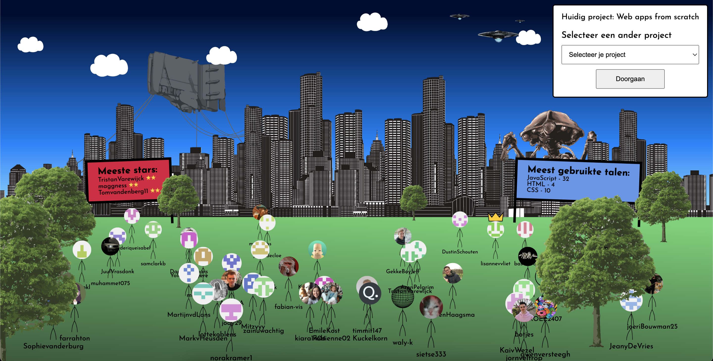

# Het minor web wereldje

Welkom bij ons project van [Project 2](https://github.com/cmda-minor-web/project-2-2122 "Minor link"). Bij dit project van de Minor 'Webdesign and development' is het de bedoeling dat we kennis gaan maken met de GitHub GraphQL API.

De website is [hier](https://minor-wereldje.herokuapp.com/ "Link") te zien.



### Contributors

- [Tim de Roller](https://github.com/maggness/ "Link")
- [Tom van den Berg](https://github.com/Tomvandenberg11/ "Link")

## Inhoudsopgave

- [Installatie](#installatie-)
- [Applicatie](#applicatie-)
- [API](#api-)
- [Service Worker](#service-worker-)
- [Licence](#licence-)
- [Credits](#credits-)

## Installatie ⚙️

#### Clonen

Om de app lokaal te laten draaien moet het project eerst lokaal worden gecloned.
Als dit stukje code gerunt wordt in de terminal wordt de repository lokaal gecloned:

`gh repo clone tomvandenberg11/project-2-2122`

Ga eerst naar de folder waarin je wilt dat het project gecloned wordt. Je kan in de terminal navigeren met `cd` met daar achter de map waar je heen wilt.

Daarna is het nodig om `node` en `npm` geinstalleerd te hebben op je lokale computer. Als je deze stappen gevolgd hebt, worden met `npm install` de benodigde packages gedownload.

#### Running

Als je de bovenstaande stappen gevolgd hebt kan de app opgestart worden door:

`npm run dev`

te runnen in de terminal.
Je ziet dan een bericht in de terminal staan op welke link de app te zien is.

## Applicatie 📱
Wij hebben ervoor gekozen om een parkje te maken met daarin alle mensen die een repo geforkt hebben. Deze repo ken rechtsboven worden aangepast. Verder staan op de billboards de repo met de meeste stars en de meest gebruikte taal. Degene met een kroontje heeft de meeste commits gedaan voor de desbetreffende repository. 

## API 💿

Voor de API van dit project hebben we de GitHub GraphQL API gebruikt. Hiermee kunnen we alle data van GitHub halen die openbaar is. 

Er dient eerst een key aangemaakt te worden in je GitHub account. Vanaf daar kan bepaalt worden welke rechten er aan die key verbonden zijn. Als er geen rechten zijn verleend kan er met de key alle openbare data van GutHub worden gehaald.

Als dat gelukt is kan er data worden opgehaald vanuit de API. We hebben de volgende query gebruikt om de data eruit te krijgen:
```javascript
query {
  repositoryOwner(login: "cmda-minor-web") {
    repository(name: "${project}") {
      forkCount
      forks(first: 60) {
        edges {
          node {
            primaryLanguage {
              id
              name
            }
            owner {
              avatarUrl
              login
              ... on User {
                url
              }
            }
            stargazerCount
            url
            defaultBranchRef {
              target {
                ... on Commit {
                  history {
                    totalCount
                  }
                }
              }
            }
          }
        }
      }
    }
  }
}
```

Hiermee kunnen we alle vakken openbare data dynamisch ophalen vanuit de API. 

De API komt met een handige documentatie waarmee de data gevonden kan worden: https://docs.github.com/en/graphql/overview/explorer

## Service Worker 🏋🏻‍♀️

De service worker zorgt ervoor dat bepaalde bestanden gecached worden in het geval er geen internet connectie meer is. De bestanden die ik cache zijn:

```javascript
const CORE_ASSETS = [
  '/styles/style.css',
  '/styles/avatar.css',
  '/styles/world.css',
  '/script/moveScript.js',
  '/script/randomizeItems.js',
  '/images/berg.jpg',
  '/images/crown.png',
  '/images/idle.png',
  '/images/vasthouden.gif',
]
```

Hierdoor zijn deze bestanden ook beschikbaar als er geen internet connectie is. De bestanden worden opgeslagen in de browser.

## Licence 👨🏻‍⚖️

Dit project is voorzien van een MIT licence. Zie de pagina LICENCE voor meer informatie.

## Credits 📣

Ik wil graag als eerste de docenten bedanken voor al hun inzet, uitleg en lesstof. Ten tweede wil ik mijn supportgroepje bedanken voor de mentale en functionele support. Ten derde wil ik Stackoverflow bedanken voor al hun antwoorden op mijn vragen.
